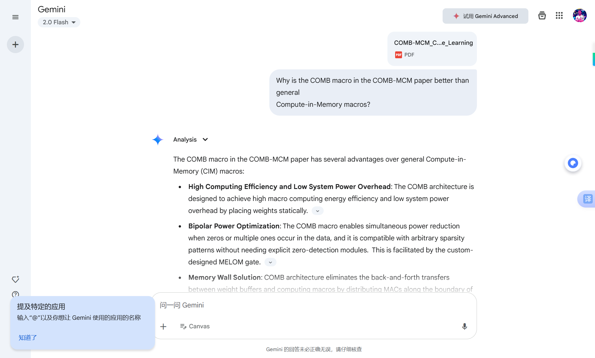

# COMB-MCM vs General Compute-in-Memory Macros

This repository contains a screenshot of the response from Google Gemini's Deep Research feature to the question:

> Why is the COMB macro in the COMB-MCM paper better than general Compute-in-Memory macros?

Feel free to explore the repository and learn more about the topic.
